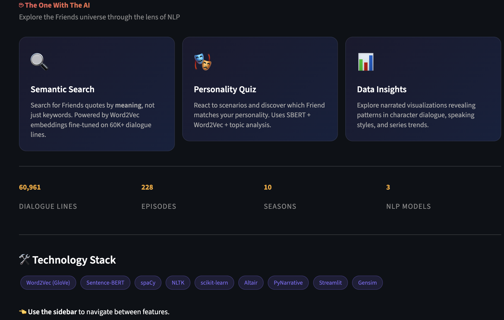
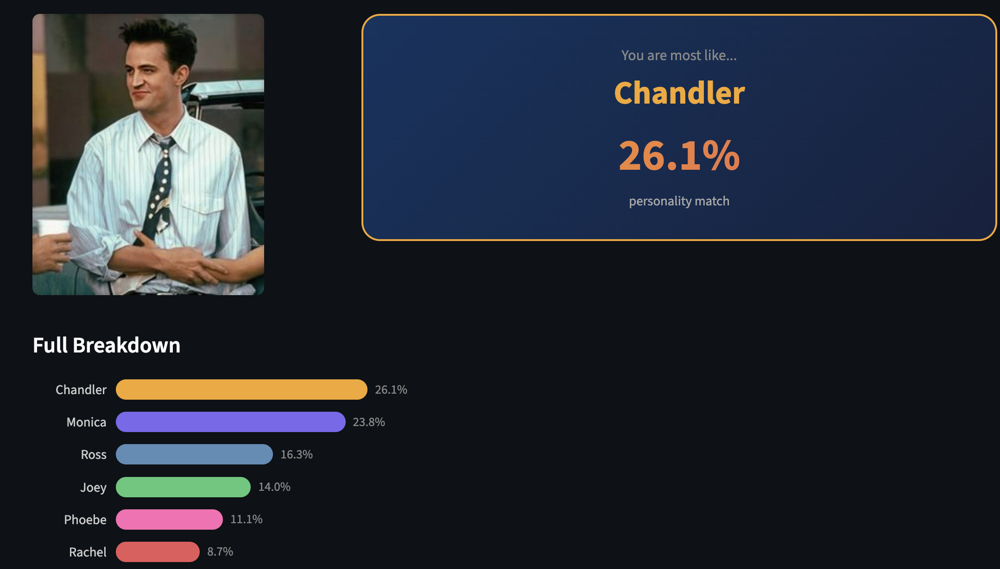
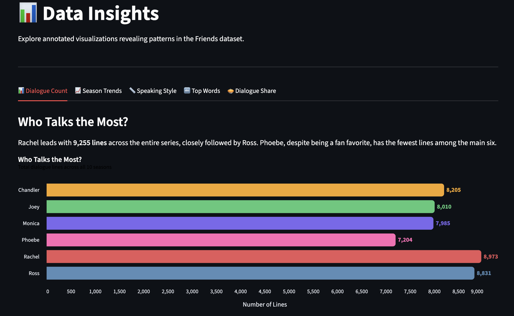

# ☕ The One With The AI

An end-to-end NLP project that uses **Word2Vec embeddings** trained on Friends TV show scripts to power semantic search and personality matching.

## ✨ Features

- **🔍 Semantic Search** — Search for Friends quotes by *meaning*, not just keywords
- **🎭 Personality Quiz** — Find out which Friend matches your personality
- **📊 Data Insights** — Explore narrated visualizations of the dataset

## 🛠️ Tech Stack

| Layer | Technology |
|---|---|
| NLP Model | Gensim Word2Vec (Skip-gram) |
| Preprocessing | spaCy, NLTK |
| Visualization | PyNarrative (Altair), ipyvizzu-story |
| Frontend | Streamlit |
| ML | scikit-learn |

## 🚀 Quick Start

```bash
# Clone the repo
git clone https://github.com/your-username/the-one-with-the-ai.git
cd the-one-with-the-ai

# Create conda environment
conda create -n nlp-project python=3.11 -y
conda activate nlp-project

# Install dependencies
pip install -r requirements.txt
python -m spacy download en_core_web_sm

# Run the app
streamlit run app.py
```

## 📁 Project Structure

```
nlp-project/
├── app.py                    # Streamlit entry point
├── requirements.txt          # Dependencies
├── data/                     # Raw & processed datasets
├── src/                      # Core logic modules
├── models/                   # Trained Word2Vec model
├── assets/                   # Character & scenario images
├── pages/                    # Streamlit multi-page app
├── notebooks/                # EDA & data story notebooks
└── docs/                     # Blog drafts
```

## 📝 License

This project is for educational purposes.

> **Disclaimer:** The Personality Quiz uses a probabilistic AI model trained on TV scripts. While we aim for 90%+ accuracy, results may vary based on your input style. It is designed primarily for entertainment purposes!

---

<div align="center">

| | |
|:-------------------------:|:-------------------------:|
|  <br> <b>Home Page</b> |  <br> <b>Personality Quiz</b> |
|  <br> <b>Semantic Search</b> |  <br> <b>Data Insights</b> |

</div>

---

*Built by Rishabh*  
*For Fun and Learning*  
*PS: I am a big fan of FRIENDS*
